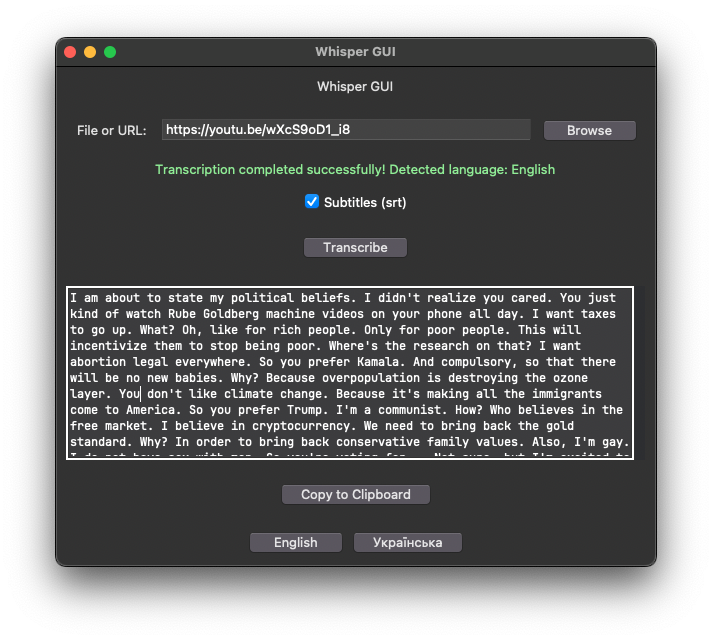

# Whisper Transcription Tool

A simple GUI application that uses OpenAI's Whisper API to transcribe audio files into text.

## Features

- Transcribe audio files in formats like MP3, WAV, M4A, and FLAC.
- Automatically compresses files larger than 25 MB.
- Displays transcription results within the application.
- Copy transcription text to the clipboard.

# GUI



## Requirements

- Python 3.11.10
- `tk`
- `requests`
- `ffmpeg` (for audio compression)

## Installation

1. **Clone the repository:**

   ```bash
   git clone github.com/awerks/whisper_gui.git
   ```

2. **Navigate to the project directory:**

   ```bash
   cd whisper_gui
   ```

3. **Create and activate the Conda environment:**

   ```bash
   conda env create -n transcription -f environment.yml
   conda activate transcription
   ```

4. **Install `ffmpeg`:**

   - On macOS using Homebrew:

     ```bash
     brew install ffmpeg
     ```

   - On Windows, download from [FFmpeg website](https://ffmpeg.org/download.html).

5. **Set up the OpenAI API key:**

   - Obtain your OpenAI API key and set it as an environment variable:

     - On Linux/macOS:

       ```bash
       export OPENAI_TRANSCRIPTION_KEY='your_api_key_here'
       ```

     - On Windows:

       ```cmd
       set OPENAI_TRANSCRIPTION_KEY='your_api_key_here'
       ```

## Usage

Run the application:

```bash
python3 program.py
```

- A GUI window will open where you can select an audio file and transcribe it.
- Transcription results will appear in the text area of the application.
- Use the "Copy to Clipboard" button to copy the transcription.

## Notes

- Ensure `ffmpeg` is installed and added to your system's PATH.
- The application supports audio files up to 25 MB without compression.
- Larger files will be compressed automatically before transcription.

## License

Distributed under the MIT License.

## Acknowledgments

- Powered by [OpenAI's Whisper API](https://openai.com).
